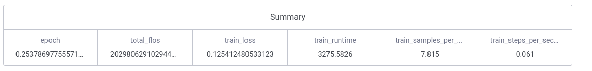
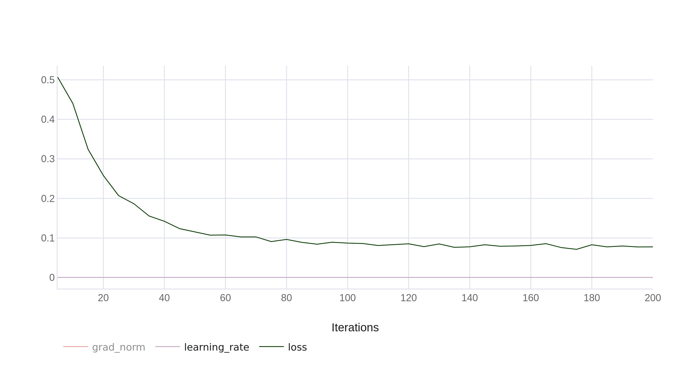

# gemma4-rico

Fine-tuned **Gemma 4 E2B** for **decoda**, a mobile app that analyses
**screenshots and user conversations**. The model is trained on a mix of:

- [`rootsautomation/RICO-Screen2Words`](https://huggingface.co/datasets/rootsautomation/RICO-Screen2Words) — 22k mobile-app screenshots with captions (vision grounding).
- [`OpenAssistant/oasst1`](https://huggingface.co/datasets/OpenAssistant/oasst1) — multi-turn human conversations (general chat ability).

The trained adapter (`gemma4_e2b_rico_adapter`, ~145 MB) sits on top of
`unsloth/gemma-4-E2B-it` and fits comfortably on a single 24 GB GPU
(4090 / 3090). It's what the bundled API serves.

---

## Datasets

Two datasets are mixed at a **3 : 1 RICO : OASST** ratio. The split is
deliberate: each dataset teaches one of decoda's two surfaces.

### RICO-Screen2Words (vision)

- **What it is.** 22,417 Android-app screenshots paired with 5 short
  human-written captions each (≈112k caption samples total). The dataset
  was originally introduced in *Screen2Words: Automatic Mobile UI
  Summarization with Multimodal Learning* (Wang et al., UIST 2021).
- **Why it fits decoda.** RICO screens are real, in-the-wild mobile UIs —
  settings pages, signup flows, media players, e-commerce, productivity.
  This is exactly the visual distribution a user-submitted screenshot in
  decoda will come from. The captions are *function-oriented*
  ("page displaying the settings", "screen for ordering a ride"), which
  is the register decoda needs for screen summaries — not photo-style
  captions like "a phone with a colorful screen".
- **What we use.** All five reference captions per screen become five
  training samples for that screen. Splits are deduped by `screenId`, so
  no screen appears in both train and test.

### OpenAssistant/oasst1 (chat)

- **What it is.** ~84k human-written messages organised into multi-turn
  conversation trees across 35 languages, with quality rankings.
  Apache 2.0 licensed, safe for commercial use.
- **Why it fits decoda.** RICO captions alone train a model into a clipped
  caption register ("page displaying X") that's poor at follow-up
  questions like "what can the user do on this screen?". Mixing in OASST
  preserves general conversational ability so the "messages" half of
  decoda's UX feels natural.
- **What we use.** We walk OASST's parent-id tree and keep only
  rank-0 assistant leaves (best-of-siblings). OASST samples carry no
  system prompt and no image, so the model learns to switch between
  "UI assistant" mode (image + UI system prompt present) and "general
  chat" mode (plain text) based on context.

### Impact on decoda

decoda has two input surfaces, and the dataset mix maps to them directly:

| User action in decoda                      | Backend path           | Trained by    |
|--------------------------------------------|------------------------|---------------|
| Uploads a screenshot, asks "what is this?" | vision (Unsloth)       | RICO captions |
| Asks a follow-up about a previous screen   | vision (multi-turn)    | OASST + RICO  |
| Sends a plain text message                 | ollama (text GGUF)     | OASST         |

Concretely the finetune gives decoda three things the base
`unsloth/gemma-4-E2B-it` doesn't:

1. **Mobile-UI grounding.** The base model describes screenshots in a
   verbose photo-caption style. After RICO training, decoda's screenshot
   handler returns the tight functional summary the UI surface expects
   ("page displaying trending news", "settings screen for notifications").
2. **Register switching.** Same model, two voices. With an image attached
   and the UI system prompt it acts as a screen analyst; with a plain
   text user message it falls back to conversational chat. This is what
   lets one adapter serve both decoda surfaces from a single backend.
3. **Reduced template leakage.** The base model occasionally emits an
   internal `thought\n` prefix before its answer — a chat-template
   artifact that would show up raw in decoda's UI. The finetune cleans
   this up because every training assistant turn ends with the proper
   end-of-turn marker.

---

## Architecture

```
                      +-----------------------+
   client (mobile) -> |  api  (proxy, 2222)   |
                      +-----------+-----------+
                                  |
                  image attached? | yes -> vision (Unsloth, port 8000)
                                  | no  -> ollama (GGUF,   port 11434)
                                  v
                      +-----------------------+
                      |  vision: full Gemma-4 |
                      |  multimodal           |
                      +-----------------------+
                      |  ollama: text-only    |
                      |  GGUF (q4_k_m)        |
                      +-----------------------+
```

The proxy preserves a single API shape (`/chat`, `/generate`, `/health`) so the
mobile client stays unchanged whether or not an image is sent.

---

## Quick start

```bash
# 1) One-time: export the GGUF that ollama-init loads.
#    Runs in your local conda env, not Docker.
python export_gguf.py
# -> ./gemma4_e2b_rico_gguf/unsloth.Q4_K_M.gguf (~3 GB)

# 2) Bring up all four services (ollama, ollama-init, vision, api).
docker compose up --build
# First run: ~5 min for the vision image (PyTorch base + pip).

# 3) Sanity check
curl http://localhost:2222/health
```

Test the **text** path (routes to Ollama):
```bash
curl -X POST http://localhost:2222/chat \
  -F 'payload={"messages":[{"role":"user","content":"Summarise screen-recording apps in two sentences."}],"max_tokens":100}'
```

Test the **vision** path (routes to Unsloth):
```bash
curl -X POST http://localhost:2222/chat \
  -F 'payload={"messages":[{"role":"user","content":"Describe what this screen does."}],"max_tokens":80}' \
  -F 'image=@/path/to/screenshot.png'
```

---

## Fine-tuning results



Numbers below come from `gemma4_rico_eval.ipynb` on `gemma4_e2b_rico_adapter`
— 100 RICO test screens (5 refs each) and 50 OASST validation chains.
Base = the same E2B model with the LoRA disabled via
`model.disable_adapter()`, so the comparison is on identical inputs and
the delta isolates the finetune's contribution.

| metric                | base   | finetuned | delta   |
|-----------------------|-------:|----------:|--------:|
| RICO BLEU-4 (5 refs)  |  1.79  |   2.01    | +0.22   |
| RICO ROUGE-L (best-5) | 19.32  |  20.75    | +1.43   |
| OASST chat ROUGE-L    | 16.95  |  17.09    | +0.14   |

**Reading the numbers:**

- The metric deltas are modest. E2B's base is already a competent
  describer of screens — there's less headroom for the finetune to
  capture in n-gram overlap than there is in a larger model.
- OASST ROUGE-L is essentially flat (+0.14), which is the **point** of
  including OASST in the mix: chat ability didn't regress while we
  pulled the model toward mobile-UI captions.
- The *qualitative* shift is bigger than BLEU/ROUGE suggests. The
  finetune consistently produces tighter, more decisive descriptions —
  see the samples below. RICO's gold captions are extremely terse
  ("display of settings options for a language learning app"), so a
  model that still uses "This screen shows..." preludes won't score
  well even if its content is correct.

### Qualitative samples (from cell 15)

A representative RICO triple showing the conciseness shift:

```
REF : display of news stories in a online media app
BASE: This screen appears to be the homepage of a mobile app called
      "BuzzFeed," featuring trending articles, curated content like a
      cookbook, and various quiz sections.
FT  : This screen is the homepage of BuzzFeed, featuring trending
      articles, a cookbook section, and various quizzes.
```

An OASST chat triple showing chat ability is preserved:

```
USER: In what situations is Selenium a better choice?
FT  : While Cypress shines in terms of developer experience and modern
      web application testing, Selenium remains a better choice in
      several specific situations: 1. Cross-Browser and Cross-Platform
      Testing is Critical — Broader Browser Support: Selenium natively
      supports a wider range of browsers and operating systems ...
```

### What would push the numbers higher

The eval is intentionally small (100 screens, 800 training steps). If
you want to chase the original Screen2Words paper's ~46 BLEU-4 number,
the levers are:

1. **More training steps.** 800 is a smoke run. Real training is closer
   to a full epoch over ~100k samples (~6-8k steps at batch 128).
2. **Higher RICO ratio.** The training mix is 3:1 RICO:OASST. Drop to
   4:1 or 5:1 by changing `// 3` → `// 4` in cell 14 of the training
   notebook. Watch the OASST ROUGE-L stays flat as you do.
3. **Larger LoRA rank.** Bump `r=16` → `r=32` in cell 8. Adds parameters
   the model can use to specialise to the register.
4. **Full RICO test set in eval.** `EVAL_N=100` is for speed; bump it to
   `len(ds["test"])` (~4310 screens) for a number you'd put in a paper.

---

## Training

See `gemma4_rico_finetune.ipynb`. Key choices:



| Setting               | Value                                           |
|-----------------------|-------------------------------------------------|
| Base                  | `unsloth/gemma-4-E2B-it`, 4-bit QLoRA           |
| LoRA rank / alpha     | 16 / 16                                         |
| Vision layers         | **trained** (`finetune_vision_layers=True`)     |
| Chat template         | `gemma-4`                                       |
| Data mix              | 3 : 1 RICO : OASST (see cell 6b)                |
| Steps                 | 800 (smoke run)                                 |
| Optimiser             | adamw_8bit, lr 1e-4, cosine, weight decay 0.01  |
| Batch                 | 16 per device × 8 grad-accum = 128 effective    |
| Tracking              | ClearML (`project=gemma4`)                      |

A non-obvious gotcha you'll hit if you adapt this notebook:
**mixing image + text-only samples in one batch breaks Gemma 4's
processor.** It enforces `len(images) == len(text)` per batch. The
notebook attaches a 32×32 placeholder image to OASST samples to satisfy
the check. ~256 vision tokens wasted per OASST sample, no measurable
regression.

---

## Evaluation

See `gemma4_rico_eval.ipynb`. Standalone notebook, does not retrain. Loads
the adapter, runs three blocks:

1. **RICO captioning** — corpus BLEU-4 (5 refs) and best-of-5 ROUGE-L on
   `ds["test"]`.
2. **OASST chat** — ROUGE-L on the OASST `validation` split.
3. **Base vs finetuned** — re-runs both eval sets inside
   `model.disable_adapter()` so the base model is scored on the same
   inputs. Prints a delta table and side-by-side qualitative samples.

Knobs at the top: `EVAL_N`, `CHAT_EVAL_N`, `MAX_NEW_TOKENS_*`. Don't
change `SYSTEM_PROMPT` — it has to match what training used, or you'll
undermeasure the lift.

---

## Repo layout

```
gemma4/
  gemma4_rico_finetune.ipynb       # main training notebook
  gemma4_oasst1_finetune.py        # original text-only OASST notebook
  gemma4_rico_eval.ipynb           # standalone eval (BLEU, ROUGE, base/FT comparison)
  export_gguf.py                   # merge LoRA + export GGUF for Ollama
  infer_image.py                   # one-shot CLI for a single image

  gemma4_e2b_rico_adapter/         # the deployed adapter

  api/
    main.py                        # FastAPI proxy (routes by image presence)
    vision_server.py               # Unsloth-direct vision backend
    Dockerfile                     # slim Python image for proxy
    Dockerfile.vision              # PyTorch base for vision
    requirements.txt               # proxy deps
    requirements.vision.txt        # vision deps (pinned to working conda env)

  Modelfile.docker.rico            # Gemma-4 chat template + system prompt
  docker-compose.yml               # 4-service orchestration
```

---

## API reference

All three endpoints accept the same shapes the previous Ollama-only proxy
used — mobile clients don't need changes.

### `POST /chat` (multipart)
- `payload` (Form, JSON string):
  ```json
  {
    "messages": [
      {"role": "user", "content": "Describe this screen."}
    ],
    "stream": false,
    "temperature": 0.7,
    "top_p": 0.9,
    "max_tokens": 256
  }
  ```
- `image` (File, optional): when present, the request is routed to the
  vision backend and the image is attached to the last user message
  internally.

Returns `{"response": "..."}` or an SSE stream when `stream: true`:
```
data: {"message": "page displaying"}
data: {"message": " the settings"}
data: {"is_message_completed": true}
```

### `POST /generate` (JSON)
Text-only single-prompt completion, always routed to Ollama:
```json
{ "prompt": "Summarise this app screen.", "max_tokens": 100 }
```

### `GET /health`
Returns the status of both backends:
```json
{
  "ok": true,
  "ollama": {"ok": true, "model": "gemma4-rico", "available": ["gemma4-rico:latest"]},
  "vision": {"ok": true, "url": "http://vision:8000"}
}
```

---

## Notes / caveats

- **Single GPU.** Both backends share the 4090. Generation is serialised
  inside the vision server (`asyncio.Lock`) because `model.generate` is not
  thread-safe.
- **First request is slow.** ~5–10 s on the vision path while CUDA kernels
  JIT. Subsequent calls are fast.
- **Ollama vision in GGUF.** Gemma-4 image support in llama.cpp / Ollama
  requires a separate `mmproj` projector file which `save_pretrained_gguf`
  does not reliably produce yet. That's why the architecture has a
  dedicated vision backend rather than asking Ollama to do everything.
- **OASST validation has trolls.** Some "gold" replies are joke/refusal
  annotations that drag ROUGE-L down by a few points. Treat OASST ROUGE-L
  as a regression signal, not an absolute quality score.
